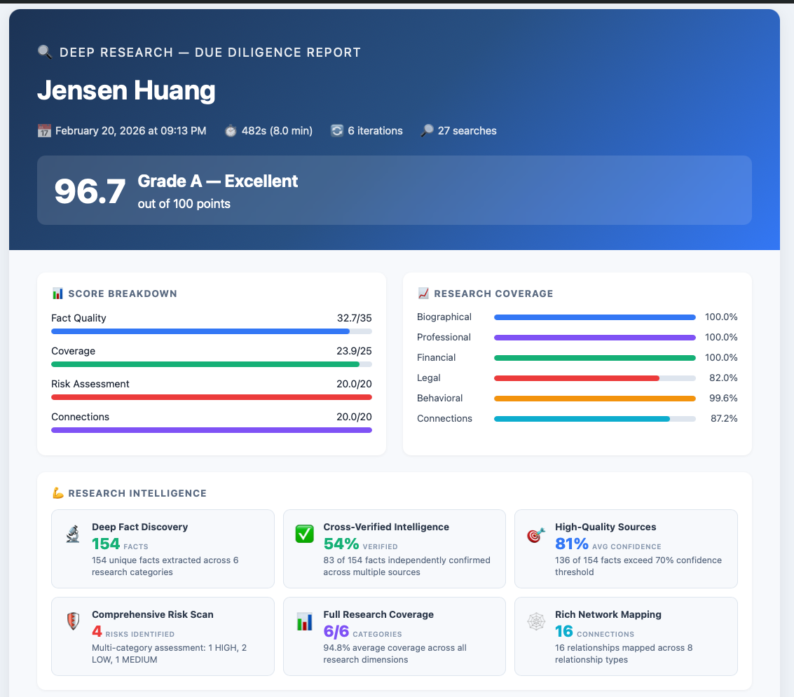
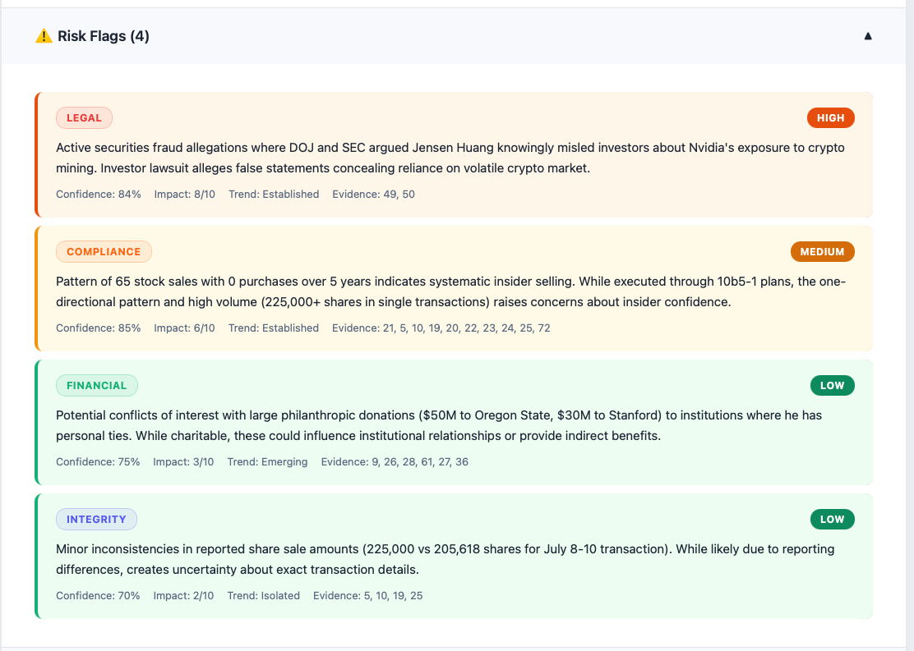
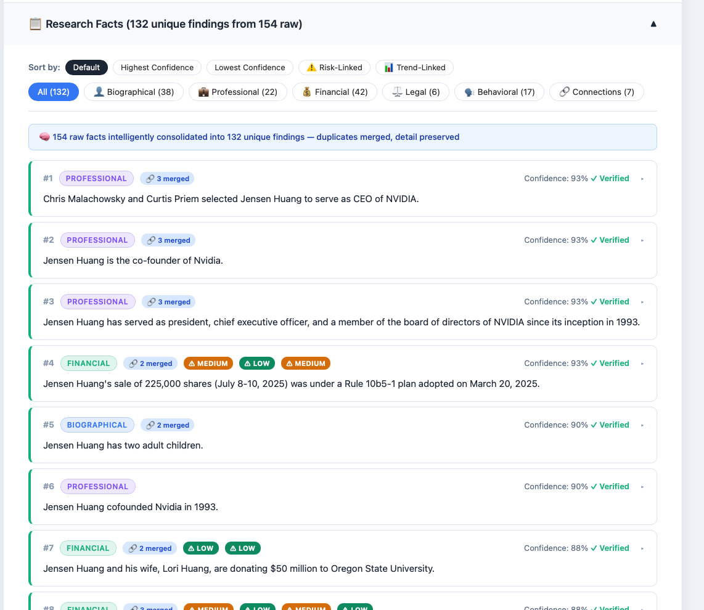
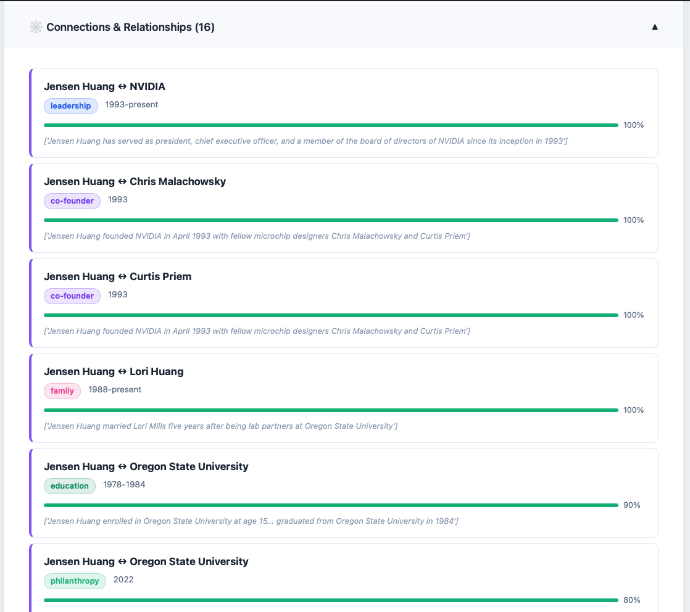
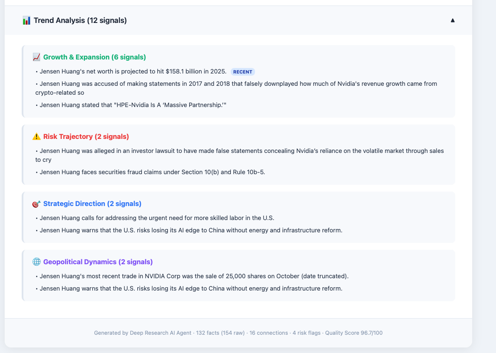

# Deep Research AI Agent

### Autonomous Due Diligence Intelligence System

[](https://www.python.org/downloads/)
[](https://github.com/langchain-ai/langgraph)
[](https://opensource.org/licenses/MIT)

> **Autonomous research agent** that conducts comprehensive due diligence investigations on individuals and entities — uncovering facts, assessing risks, mapping connections, and generating interactive HTML intelligence reports.

<p align="center">
  
</p>

---

## What This Does

Run a single command with any person or company name. The agent autonomously researches them across the web and generates a comprehensive due diligence report giving facts, risks, connections, and trends that are scored on a 100-point scale.

```bash
python scripts/research.py "Jensen Huang" --save --html --iterations 10
```

The agent autonomously:
1. **Plans** an investigation strategy using Claude Opus 4 — generating 15 targeted search queries across biographical, professional, financial, legal, behavioral, and connections categories
2. **Searches** the web iteratively — executing queries via Brave Search and Serper, refining based on findings each round
3. **Extracts** structured facts from raw search results using Gemini 2.5 Flash for speed
4. **Verifies** facts through cross-referencing and confidence scoring
5. **Assesses risks** — securities fraud, compliance issues, reputational concerns — using Claude's reasoning
6. **Maps connections** — co-founders, employers, family, partners, investors — with relationship strength scores
7. **Generates** an interactive HTML report with consolidation, filtering, sorting, trend analysis, and a 100-point quality score

### Real Performance (Jensen Huang, 10 iterations)

| Metric | Result |
|--------|--------|
| Facts discovered | 110 (95 after deduplication) |
| Risk flags | 5 (1 HIGH, 2 MEDIUM, 2 LOW) |
| Connections mapped | 17 across 9 relationship types |
| Research coverage | 93.6% across 6 categories |
| Quality score | 96.9/100 — Grade A |
| Duration | 327 seconds (5.4 minutes) |
| Cost | ~$0.56 total API spend |
| Search iterations | 4 (stopped at 93% coverage threshold) |

---

## Report Screenshots

<details>
<summary><b>📊 Score Breakdown & Research Intelligence</b> (click to expand)</summary>
<br/>

<p><em>Executive summary with 4-dimension scoring (Fact Quality 33/35, Coverage 23.9/25, Risk Assessment 20/20, Connections 20/20), research coverage percentages per category, and 6 intelligence metric cards.</em></p>
</details>

<details>
<summary><b>⚠️ Risk Flags</b> (click to expand)</summary>
<br/>

<p><em>5 risk flags with styled category labels (LEGAL, COMPLIANCE, TAX, FINANCIAL, REPUTATIONAL), color-coded severity (HIGH/MEDIUM/LOW), confidence percentages, impact scores, and trend indicators.</em></p>
</details>

<details>
<summary><b>📋 Fact Cards with Intelligent Consolidation</b> (click to expand)</summary>
<br/>

<p><em>110 raw facts intelligently consolidated into 95 unique findings. Near-duplicate facts merged (e.g., "CEO of Nvidia" + "President of NVIDIA" + "served as CEO since inception" → single entry with "🔗 4 merged" badge). Click anywhere to expand evidence details.</em></p>
</details>

<details>
<summary><b>🕸️ Connection Mapping</b> (click to expand)</summary>
<br/>

<p><em>17 relationships mapped across 9 types (leadership, co-founder, family, employer, education, philanthropy, investor/partner, recognition). Strength bars and time periods for each connection.</em></p>
</details>

<details>
<summary><b>📈 Trend Analysis</b> (click to expand)</summary>
<br/>

<p><em>16 trend signals grouped into Growth & Expansion (10), Risk Trajectory (2), Strategic Direction (3), and Geopolitical Dynamics (1). Recent signals flagged with badges.</em></p>
</details>

---

## Architecture

```
┌─────────────────────────────────────────────────────────────┐
│                    CLI Entry Point                           │
│              scripts/research.py --html --save               │
└──────────────────────────┬──────────────────────────────────┘
                           │
                           ▼
┌─────────────────────────────────────────────────────────────┐
│              LangGraph Orchestration Engine                  │
│                  src/core/workflow.py                        │
│                                                             │
│  Initialize → Plan Strategy → Execute Searches → Extract    │
│  Facts → Refine Queries → (loop) → Verify → Assess Risks   │
│  → Map Connections → Generate Report                        │
└──────────────────────────┬──────────────────────────────────┘
                           │
         ┌─────────────────┼─────────────────┐
         ▼                 ▼                 ▼
┌──────────────┐  ┌──────────────┐  ┌──────────────┐
│ Claude Opus 4│  │ Gemini 2.5   │  │ GPT-4 Turbo  │
│              │  │ Flash        │  │              │
│ • Strategy   │  │ • Extraction │  │ • Fallback   │
│ • Risk       │  │ • Speed      │  │ • Structure  │
│ • Connections│  │ • Volume     │  │ • JSON       │
└──────────────┘  └──────────────┘  └──────────────┘
         │                 │                 │
         └─────────────────┼─────────────────┘
                           │
                           ▼
┌─────────────────────────────────────────────────────────────┐
│                 Search Engines                               │
│            Brave Search  |  Serper (Google)                  │
└──────────────────────────┬──────────────────────────────────┘
                           │
                           ▼
┌─────────────────────────────────────────────────────────────┐
│              HTML Report Generation                          │
│                                                             │
│  Interactive report with:                                   │
│  • Quality scoring (100-point scale)                        │
│  • Fact consolidation (Jaccard + containment dedup)         │
│  • Category filters (multi-select)                          │
│  • Sort controls (confidence, trend, category)              │
│  • Risk severity visualization                              │
│  • Connection strength mapping                              │
│  • Trend analysis                                           │
└─────────────────────────────────────────────────────────────┘
```

### Multi-Model Task Routing

The system routes tasks to the optimal model based on task type:

| Task | Model | Reasoning |
|------|-------|-----------|
| Strategy planning | Claude Opus 4 | Superior reasoning, strategic thinking |
| Query refinement | Claude Opus 4 | Analytical depth, gap identification |
| Fact extraction | Gemini 2.5 Flash | Speed, large context window (2M tokens) |
| Risk assessment | Claude Opus 4 | Nuanced analysis, pattern recognition |
| Connection mapping | Claude Opus 4 | Relationship inference, synthesis |
| Fallback | GPT-4 Turbo | Reliable structured output |

---

## Project Structure

```
deep-research-agent/
├── scripts/
│   └── research.py              # CLI entry point + HTML report generation (2,258 lines)
├── src/
│   ├── core/
│   │   ├── workflow.py           # LangGraph orchestration engine (1,540 lines)
│   │   └── state_manager.py      # Research state management (593 lines)
│   ├── models/
│   │   ├── base_client.py        # Abstract base for AI clients (523 lines)
│   │   ├── claude_client.py      # Anthropic Claude client with prompt caching (380 lines)
│   │   ├── gemini_client.py      # Google Gemini client (374 lines)
│   │   ├── openai_client.py      # OpenAI GPT-4 client (314 lines)
│   │   └── router.py             # Multi-model task router (698 lines)
│   ├── search/
│   │   ├── strategy.py           # Consecutive search strategy engine (1,406 lines)
│   │   └── executor.py           # Brave/Serper search executor
│   ├── extraction/
│   │   └── extractor.py          # AI-powered fact extraction (924 lines)
│   └── database/
│       ├── models.py             # SQLAlchemy ORM models (311 lines)
│       ├── connection.py         # Database connection pooling (195 lines)
│       └── repository.py         # Data access layer (188 lines)
├── config/
│   ├── settings.py               # Pydantic settings with validation (536 lines)
│   └── logging_config.py         # Structlog JSON logging (437 lines)
├── tests/
│   ├── run_evaluation.py         # Full evaluation suite (587 lines)
│   ├── run_quality_evaluation.py # Quality scoring tests (311 lines)
│   └── test_quality_score.py     # Unit tests for scoring (501 lines)
├── docs/
│   ├── IMPLEMENTATION_PLAN.md    # Architecture decisions
│   ├── TECHNICAL_ARCHITECTURE.md # System design
│   ├── PRD.md                    # Product requirements
│   ├── EXECUTIVE_SUMMARY.md      # Project overview
│   └── EVALUATION_DATASET.md     # Test personas & framework
├── requirements.txt
├── .env.example
├── .gitignore
└── README.md
```

---

## Quick Start

### Prerequisites

- **Python 3.11+**
- API keys for: **Anthropic** (Claude), **Google** (Gemini), **OpenAI** (GPT-4), **Brave Search**
- Optional: **Serper** (Google search fallback)

### Installation

```bash
# Clone the repository
git clone https://github.com/YOUR_USERNAME/deep-research-agent.git
cd deep-research-agent

# Create and activate virtual environment
python3.11 -m venv venv
source venv/bin/activate  # Windows: .\venv\Scripts\activate

# Install dependencies
pip install -r requirements.txt

# Configure API keys
cp .env.example .env
# Edit .env with your API keys
```

### Configuration

Copy `.env.example` to `.env` and fill in your keys:

```bash
# Required
ANTHROPIC_API_KEY=sk-ant-...        # Claude Opus 4
GOOGLE_API_KEY=AI...                # Gemini 2.5 Flash
OPENAI_API_KEY=sk-...               # GPT-4 Turbo (fallback)
BRAVE_API_KEY=BSA...                # Brave Search

# Optional
SERPER_API_KEY=...                  # Google search via Serper (fallback)
```

### Run Research

```bash
# Basic research (console output only)
python scripts/research.py "Tim Cook"

# Full research with HTML report and JSON export
python scripts/research.py "Jensen Huang" --save --html --iterations 10

# Quick research (fewer iterations)
python scripts/research.py "Satya Nadella" -i 5 -s --html

# Custom output path
python scripts/research.py "Elon Musk" -i 20 -s --output results/elon.json --html
```

### CLI Arguments

| Argument | Short | Default | Description |
|----------|-------|---------|-------------|
| `query` | — | required | Person or entity to research |
| `--iterations` | `-i` | 10 | Maximum search iterations |
| `--save` | `-s` | false | Save results to JSON |
| `--html` | — | false | Generate interactive HTML report |
| `--output` | — | auto | Custom output file path |

---

## How It Works

### 1. Strategy Planning

Claude Opus 4 generates an initial set of 15 targeted search queries spanning 6 categories (biographical, professional, financial, legal, behavioral, connections) at varying depth levels (1-5). Each query has a specific investigative purpose.

### 2. Iterative Search & Extraction

The system executes 5 queries per iteration, extracts facts using Gemini 2.5 Flash, then refines the next batch of queries based on what's been discovered and what gaps remain. This consecutive search strategy means each iteration is informed by all previous findings.

### 3. Coverage-Driven Termination

Research continues until either the coverage threshold is met (default: 93%) or the maximum iterations are reached. Coverage is computed as a weighted average across all 6 research categories using information entropy.

### 4. Verification & Scoring

Facts are deduplicated, cross-referenced for corroboration, and assigned confidence scores. The 100-point quality score breaks down as:

- **Fact Quality** (35 pts): Quantity, average confidence, corroboration ratio
- **Research Coverage** (25 pts): Category breadth, depth per category, distribution entropy
- **Risk Assessment** (20 pts): Number and severity of identified risks
- **Connection Mapping** (20 pts): Relationship count, type diversity

### 5. HTML Report Generation

The interactive report includes:
- **Visual strength cards** — 6 intelligence metrics with progress bars
- **Intelligent fact consolidation** — Jaccard similarity + containment dedup with min-2-shared-words guard
- **Multi-select category filters** — Toggle categories independently
- **Sort controls** — By confidence, trend, or category
- **Click-anywhere expand** — Full evidence details on any fact card
- **Styled risk labels** — Color-coded severity pills
- **Trend analysis** — Growth, risk trajectory, strategic direction, geopolitical dynamics
- **Connection mapping** — Relationship type pills with strength bars

---

## Quality Scoring

The system produces a research quality score from 0-100:

| Grade | Score | Quality |
|-------|-------|---------|
| A+ | 95-100 | Exceptional |
| A | 90-94 | Excellent |
| B+ | 85-89 | Very Good |
| B | 80-84 | Good |
| C+ | 70-79 | Adequate |
| C | 60-69 | Needs Improvement |
| D | 50-59 | Poor |
| F | 0-49 | Insufficient |

---

## Cost Breakdown

Typical costs per research run (based on Jensen Huang, 10 iterations):

| Component | Model | Cost |
|-----------|-------|------|
| Strategy planning (4×) | Claude Opus 4 | ~$0.20 |
| Fact extraction (4×) | Gemini 2.5 Flash | ~$0.006 |
| Risk assessment | Claude Opus 4 | ~$0.10 |
| Connection mapping | Claude Opus 4 | ~$0.15 |
| Search API calls (20) | Brave Search | ~$0.10 |
| **Total** | | **~$0.56** |

---

## Key Design Decisions

**Why multi-model instead of single model?** Claude Opus 4 excels at strategic reasoning and nuanced analysis but is expensive and slower. Gemini 2.5 Flash handles bulk extraction from large documents at 1/50th the cost and 2× the speed. GPT-4 Turbo provides reliable structured JSON output as a fallback. Using each model for what it does best keeps costs under $1/report while maintaining quality.

**Why Jaccard + containment for deduplication?** Pure Jaccard similarity misses subset relationships ("born in Taiwan" vs "born February 17, 1963, in Tainan, Taiwan" — Jaccard is low because the detailed fact has many unique words). Containment catches these asymmetric relationships. The min-2-shared-words guard prevents false merges on very short facts.

**Why coverage-driven termination instead of fixed iterations?** Different subjects require different amounts of research. A well-documented public figure like Jensen Huang reaches 93% coverage in 4 iterations, while an obscure private individual might need all 10. Coverage-driven termination saves time and money on easy targets while ensuring thoroughness on hard ones.

**Why LangGraph over raw async?** LangGraph provides state management, conditional edges (the coverage check loop), and potential checkpointing for long-running research. The graph structure makes the workflow explicit and debuggable.

---

## Documentation

| Document | Description |
|----------|-------------|
| [IMPLEMENTATION_PLAN.md](docs/IMPLEMENTATION_PLAN.md) | Architecture decisions and system design |
| [TECHNICAL_ARCHITECTURE.md](docs/TECHNICAL_ARCHITECTURE.md) | Detailed technical specifications |
| [PRD.md](docs/PRD.md) | Product requirements |
| [EXECUTIVE_SUMMARY.md](docs/EXECUTIVE_SUMMARY.md) | Project overview and roadmap |
| [EVALUATION_DATASET.md](docs/EVALUATION_DATASET.md) | Test personas and evaluation framework |

---

## License

MIT License — see [LICENSE](LICENSE) for details.

---

<p align="center">
  Built with Claude Opus 4 · Gemini 2.5 Flash · GPT-4 Turbo · LangGraph · Brave Search
</p>
