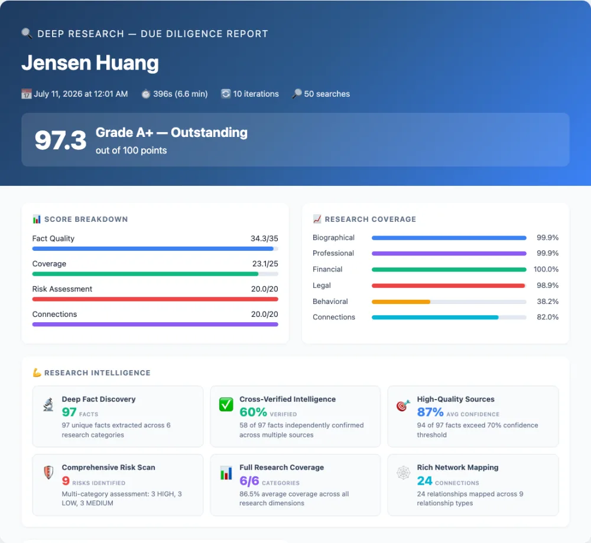
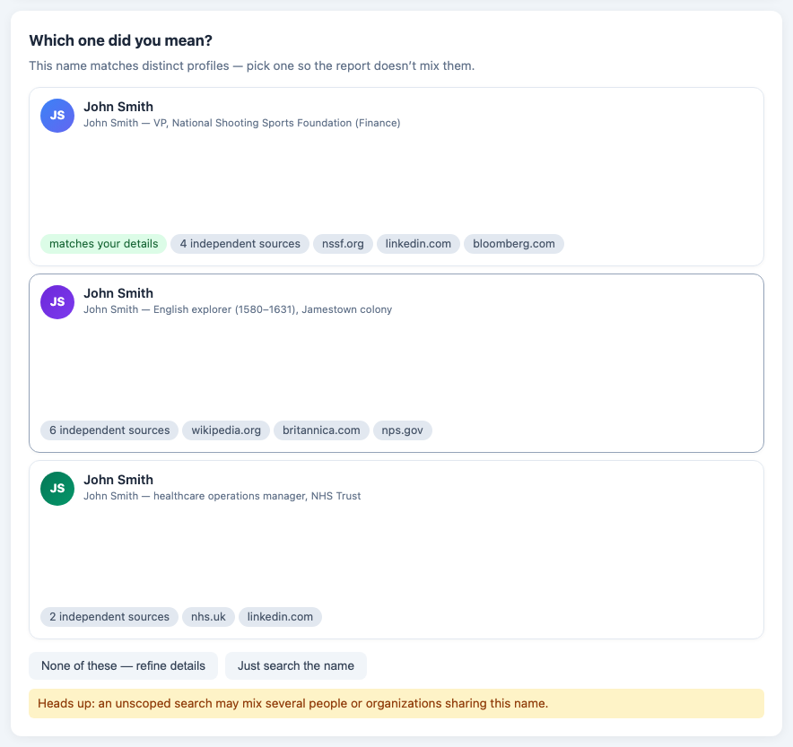
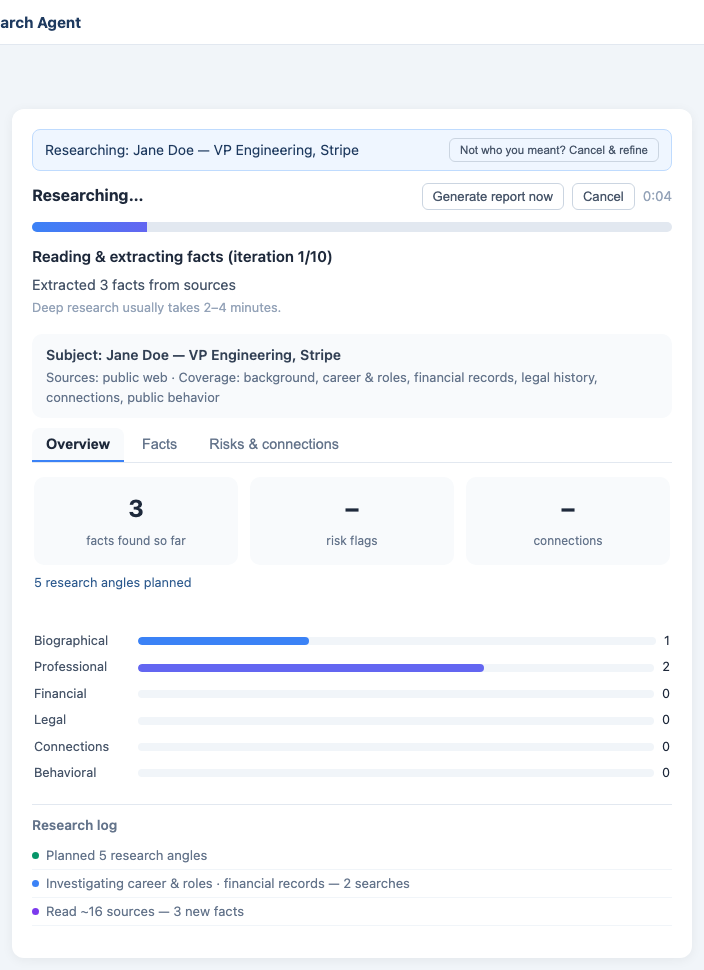
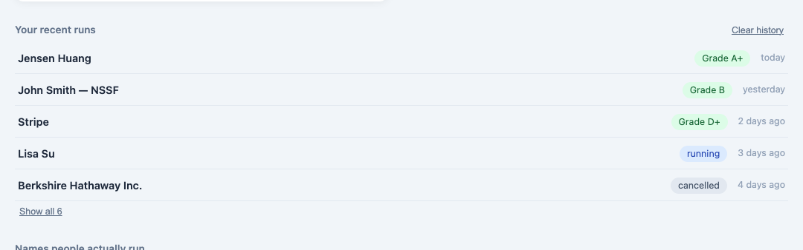
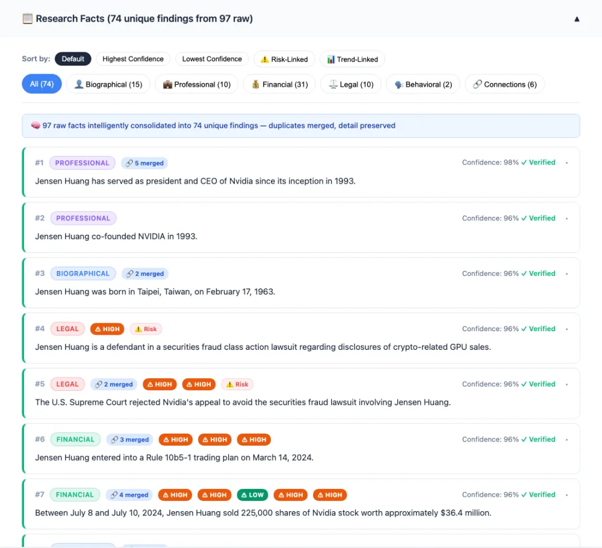
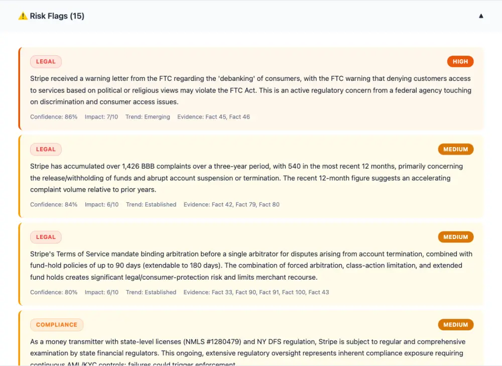

# Deep Research Agent

[](https://www.python.org/downloads/)
[](https://fastapi.tiangolo.com/)
[](https://github.com/langchain-ai/langgraph)
[](LICENSE)

Autonomous due-diligence research on any person or company. Give it a name and it plans a research strategy, sweeps the public web, extracts and cross-checks facts, flags risks, maps connections, and delivers a cited, scored report in minutes. It runs as a public web service with live streaming progress and shareable run pages, and as a CLI.

Live at [tryvettr.com](https://tryvettr.com).

<p align="center">
  
</p>

## What it does

A research run is a full investigation, not a chat answer:

1. A pre-flight step identifies who you actually mean. Common names match many people, so the agent clusters candidates from live search evidence and asks you to pick before spending anything.
2. Claude plans an investigation strategy: targeted queries across biographical, professional, financial, legal, behavioral, and connections categories.
3. The agent searches iteratively through Brave and Serper, extracting structured facts with Gemini after each pass and refining the next round of queries based on what it found and what is still missing.
4. Facts are deduplicated, cross-referenced for corroboration, and confidence-scored. Facts about other people who share the name are detected and set aside rather than mixed in.
5. Claude assesses risk signals and maps relationships, then the system renders an interactive HTML report where every fact, risk, and trend cites its sources, and the whole report gets a 100-point quality score.

You watch all of this happen live: each run has its own page at `/research/{id}` with a streaming activity feed, fact counters filling in, and a report preview that builds as the agent works.

## Results

Measured on the current models (July 2026), 3 iterations, well-documented subject:

| Metric | Jensen Huang |
|--------|--------------|
| Facts discovered | 48 (40 after consolidation) |
| Risk flags | 9 across multiple categories |
| Connections mapped | 25 across 10 relationship types |
| Quality score | 95.8/100, Grade A |
| Duration | 147 seconds |
| Model spend | $0.19 (Claude $0.182, Gemini $0.006, fallback unused) |

The harder test is a common name. Asked for "John Smith" with the hints "NSSF, VP Finance", the pre-flight surfaced the right person out of a field that included a 17th-century explorer, and the run produced 12 main facts, all about the correct John Smith, with 35 facts about other John Smiths explicitly set aside and cited in their own report section. The lead risk flag was a genuine finding about the right person. The report honestly graded itself D+ (Shallow Coverage) because a low-footprint subject yields a thin report, and the scoring measures research depth, not the subject.

## Product tour

**Pre-flight disambiguation.** Submitting an ambiguous name opens an evidence-ranked picker. Candidates are clustered from live search results and ranked by how many independent domains document them; your optional hints (company, role, location) are matched semantically and label the best fit.

<p align="center">
  
</p>

**The run page.** Every run lives at its own URL: refresh-safe, bookmarkable, and shareable. It shows the assumption banner (who is being researched, with a cancel-and-refine escape hatch), live progress, a report preview with facts, risks, and category coverage, and a narrative research log. The device that started the run gets Cancel and "Generate report now" controls; anyone else opening the link gets a watch-only view.

<p align="center">
  
</p>

**Run history.** The homepage keeps a private, device-local list of your recent runs with live status and grades. It is stored in localStorage, never on the server, so a shared run link never exposes what else you have researched.

<p align="center">
  
</p>

**The report.** Interactive HTML with consolidated fact cards, per-fact citations, color-coded risk flags, a relationship map, and trend analysis. Two full sample reports are served live: [person](https://tryvettr.com/sample-report/person) and [company](https://tryvettr.com/sample-report/company).

<p align="center">
  
  
</p>

## How a run works

The pipeline is a LangGraph state machine (`src/core/workflow.py`):

```
initialize -> plan_strategy -> execute_searches -> extract_facts -> refine_queries
                   ^                                                      |
                   |            (coverage < 93% and iterations left)      |
                   +------------------------------------------------------+
                                                                          |
                              (coverage met, finish requested, or cap hit)
                                                                          v
                        verify_facts -> assess_risks -> map_connections -> generate_report
```

Each search iteration is informed by everything found so far. Research stops when weighted category coverage crosses the 93% threshold, when the iteration cap is reached, or when the user clicks "Generate report now" (the finalization tail of verification, risks, and connections always runs).

Progress streams to the browser over Server-Sent Events. The backend polls the job row and emits the full progress snapshot on change, which makes the stream reconnect-safe by construction: a dropped connection, a page refresh, or a redeploy replays into an identical render with zero duplicated DOM.

### Multi-model routing

Each task goes to the model best suited for it (`src/models/router.py`):

| Task | Model | Why |
|------|-------|-----|
| Strategy planning, query refinement | Claude Opus 4.8 | Strategic reasoning and gap identification |
| Fact extraction | Gemini 3.1 Flash-Lite | Speed and cost at bulk-document volume |
| Risk assessment, connection mapping | Claude Opus 4.8 | Nuanced analysis and relationship inference |
| Structured-output fallback | GPT-5.4 mini | Reliable JSON when a primary call fails |

An A/B against Sonnet 5 found parity on well-documented people but a large Opus advantage on company subjects (83.6 vs 65.5, where Sonnet lost connection mapping entirely) for about $0.06 more per report, so Opus 4.8 is the default. `python scripts/preflight_check.py` probes every configured model with a one-token call before you spend real money on a run.

## Researching the right person

Name collision is the failure mode that ruins due-diligence reports, so it is handled at three layers:

- **Before the run.** The pre-flight clusters search results into distinct identities and ranks them by independent-domain evidence. A dominant identity proceeds automatically with a visible, correctable assumption banner; anything ambiguous requires an explicit pick. Optional hints (company, role, location, known-for) are matched with word-boundary semantics, inflection and typo tolerance, and a strong match is labeled on the card.
- **During the run.** The chosen entity scopes query generation and extraction. Facts the extractor attributes to a different person with the same name are set aside: they never enter the counters, verification, risk analysis, or the score, but they are preserved with citations in a collapsed report section so you can audit the exclusion.
- **Across runs.** Cancelling a run because it locked onto the wrong person hands you back to the form with that identity stashed as negative scope. Resubmitting the same name tells the pipeline "not this one" end to end, from candidate clustering to extraction prompts.

## Reports you can verify

- Every fact, risk flag, and trend signal renders clickable citation chips. Source URLs are captured before the HTML-escaping chokepoint and allowlisted to http/https, so links are correct and injection-proof at the same time.
- Facts are consolidated with Jaccard similarity plus containment matching, so "CEO of Nvidia" and "served as CEO since 1993" merge into one finding with its evidence preserved.
- The 100-point score breaks down as fact quality (35), research coverage (25), risk assessment (20), and connection mapping (20), on a standard GPA scale:

| Grade | Score | Reads as |
|-------|-------|----------|
| A+ / A / A- | 90-100 | Outstanding to very good depth |
| B+ / B / B- | 80-89 | Good to satisfactory depth |
| C+ / C / C- | 70-79 | Fair to below-average depth |
| D+ / D | 65-69 | Shallow coverage, thin findings |
| F | below 65 | Minimal public data |

Low grades are worded deliberately: they describe how much the public web yielded, never the subject. Reports on low-footprint subjects say so explicitly, with the search and iteration counts that were exhausted.

## The web service

FastAPI app (`src/api/`) deployed on Railway behind Cloudflare, one Docker container, Postgres in production and sqlite for development.

| Route | Purpose |
|-------|---------|
| `GET /` | Homepage: submit form, disambiguation picker, your recent runs |
| `POST /api/disambiguate` | Pre-flight candidate discovery (Turnstile-gated) |
| `POST /api/research` | Start a job, returns 202 with the job id |
| `GET /research/{id}` | The run page (works in every job state, including expired and not-found) |
| `GET /api/research/{id}` | Job snapshot: status plus full progress |
| `GET /api/research/{id}/events` | SSE progress stream |
| `GET /api/research/{id}/report` | The finished HTML report |
| `POST /api/research/{id}/cancel`, `/finish` | Cancel, or stop searching and finalize now |
| `GET /sample-report/{person\|company}` | Live sample reports |
| `GET /healthz` | Liveness plus DB check |

Operational guardrails, all enforced server-side:

- **Abuse:** Cloudflare Turnstile on submission, IP-keyed rate limits (3 reports/hour), and a single-use HMAC ticket that carries the pre-flight verification into the research request.
- **Spend:** a monthly budget cap ($40 default) checked before and during every job, a per-job abort threshold ($1), a spend ledger, and at most 3 concurrent research jobs.
- **Data lifecycle:** reports and the submitted name are kept 7 days, then a reaper purges report HTML, JSON, query text, progress, and the salted IP hash, and the links return 410. Stale jobs are failed automatically after a heartbeat timeout.
- **Access model:** a run URL is an unguessable capability. Holding it grants watching and reading; the mutating controls render only on the device that started the run. Run and report pages ship strict CSP, `noindex`, `nosniff`, and no-store headers, so shared links stay out of crawlers and caches.
- **Rendering safety:** everything scraped from the web is treated as hostile. All dynamic text reaches the DOM through `textContent`, CSS classes come from fixed whitelists, and a repo-wide test bans the entire HTML-injection sink family across every template.

## Running locally

Prerequisites: Python 3.12+, API keys for Anthropic, Google (Gemini), OpenAI, and Brave Search (Serper optional but recommended).

```bash
git clone https://github.com/Akhera24/deep-research-ai-agent.git
cd deep-research-ai-agent
python3.12 -m venv venv && source venv/bin/activate
pip install -r requirements.txt
cp .env.example .env   # fill in your keys
```

Run the web app (the primary interface):

```bash
uvicorn src.api.main:app --port 8000 --workers 1
# open http://localhost:8000
```

The single worker is mandatory: jobs run in-process and the concurrency semaphore, cancel registry, and SSE affinity all assume one process. Scale by giving the container more resources, not more workers.

Or run the CLI directly:

```bash
python scripts/research.py "Jensen Huang" --save --html --iterations 10
```

| Argument | Default | Description |
|----------|---------|-------------|
| `query` | required | Person or company to research |
| `-i, --iterations` | 10 | Maximum search iterations |
| `-s, --save` | off | Save results to JSON |
| `--html` | off | Generate the interactive HTML report |
| `--output` | auto | Custom output path |

A typical run costs $0.20 to $0.45 all-in depending on iterations; the per-job cap aborts anything that runs away.

## Testing

```bash
pytest tests/          # 481 unit and integration tests (fast gate)
pytest -m e2e          # 97 browser tests (Playwright, requires requirements-dev.txt)
```

The browser suite boots the real app on a random port with the orchestrator replaced by a scripted stand-in, so tests drive the real routes, jobs, SSE, database, and frontend deterministically with zero model spend. Coverage includes the full cold-load state machine of the run page (running, completed, cancelled, failed, expired, unknown, malformed), SSE reconnect idempotency, XSS inertness with hostile fixtures planted at every render surface, rate-limit behavior, storage-disabled degradation, and the cross-page cancel-and-refine flow.

## Project structure

```
deep-research-agent/
├── src/
│   ├── api/                  # FastAPI service: routes, in-process job runner,
│   │   ├── templates/        #   spend ledger, retention reaper, Turnstile/ticket
│   │   └── static/           #   security; Jinja templates for homepage + run page
│   ├── core/
│   │   ├── workflow.py       # LangGraph orchestration engine
│   │   ├── preflight.py      # Pre-flight entity disambiguation
│   │   └── state_manager.py  # Shared research state
│   ├── models/               # Claude / Gemini / OpenAI clients + task router
│   ├── search/               # Strategy engine + Brave/Serper executor
│   ├── extraction/           # Structured fact extraction and attribution
│   ├── reporting/
│   │   └── html_report.py    # Quality scoring + cited, interactive HTML report
│   └── database/             # Persistence layer for CLI runs
├── config/                   # Pydantic settings, structlog config
├── scripts/                  # research.py CLI, demo.py, preflight_check.py
├── tests/                    # 481 unit tests + tests/e2e/ (97 browser tests)
├── docs/                     # Design docs and screenshots
├── Dockerfile                # python:3.12-slim, single-worker uvicorn
└── railway.json              # Railway deploy config (healthcheck, drain)
```

## Design decisions

**Multi-model over single-model.** Claude carries the reasoning-heavy steps, Gemini does bulk extraction at a fraction of the cost, and GPT-5.4 mini exists purely as a structured-output fallback. Each model does what it is best at, which is how a full investigation stays under a dollar.

**DB-polled SSE instead of a message broker.** Progress is written to the job row and the SSE endpoint polls for changes, emitting the full snapshot each time. This removed Redis entirely and made every consumer reconnect-safe for free: a refresh or redeploy replays the same state into the same render.

**Capability URLs instead of accounts.** A job id is an unguessable UUID that acts as the bearer token for watching and reading a run. Ownership (the ability to cancel or finish early) is tracked per-device in localStorage, so sharing a link shares the view, not the controls. No accounts, no cookies, no server-side session state.

**Escaping at one chokepoint, raw values captured before it.** The report renderer escapes everything once, deeply. Features that need raw values (citation hrefs, dedup keys) read from seams captured before that chokepoint, never by un-escaping afterward, which is how the citation system stayed injection-proof.

**Coverage-driven termination.** A well-documented subject converges in 3 or 4 iterations; an obscure one uses the full budget. Stopping on measured category coverage rather than a fixed count spends money where the information actually is.

**Client-side run history.** The recent-runs list lives in localStorage because the alternative is a server-side record linking one browser to every subject it researched. Keeping it on-device makes the privacy boundary structural rather than policy.

## Documentation

| Document | Description |
|----------|-------------|
| [TECHNICAL_ARCHITECTURE.md](docs/TECHNICAL_ARCHITECTURE.md) | System design and component specifications |
| [IMPLEMENTATION_PLAN.md](docs/IMPLEMENTATION_PLAN.md) | Architecture decisions |
| [PHASE3_DESIGN.md](docs/PHASE3_DESIGN.md) | Web service design: jobs, SSE, security, retention |
| [Deep_Research_Agent_PRD.md](docs/Deep_Research_Agent_PRD.md) | Product requirements |

## License

MIT. See [LICENSE](LICENSE).
